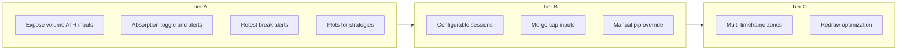

# Future upgrade scope: SupplyDemandZonesPROGC

## Current baseline

- **Pine parity goal**: The file documents alignment with TradingView “Supply Demand Zones PRO” (Pine v6), including session checks on the **confirmed bar** and **last supply/demand bar** only updating on **new** zones, not merges ([`OnBarUpdate` / `TryMerge`](d:\work\2026\0423_NinjaScript_conversion\task2\SupplyDemandZonesPROGC.cs) around lines 275–340, 476–490).
- **Absorption (PDF)**: [Absorption_Upgrade_Instructions.pdf](d:\work\2026\0423_NinjaScript_conversion\task2\Absorption_Upgrade_Instructions.pdf) is largely **already integrated**: SMA volume vs threshold, in-zone high-volume wick/body checks, and `Draw.ArrowUp` / `Draw.ArrowDown` with stable tags (see lines 265–375). **Future work** is not “add absorption from scratch” but **productize** it (below).

## Tier A — High impact, small-to-medium effort

1. **Expose absorption + ATR tunables in the UI**  
   - `volumeThresholdMultiplier` and `volumeLookback` are still **private** (lines 67–68). Add `[Display]` properties (e.g. under a group “Absorption” or “Volume filter”) with defaults 1.5 and 20.  
   - `ATR(20)` in `DataLoaded` is **fixed**; consider `ATRPeriod` input so zone sizing matches user preference.

2. **Absorption UX**  
   - Toggle to **show/hide** absorption arrows (independent of zones).  
   - Optional **Alert** when absorption fires (same sound/message pattern as new-zone alerts).  
   - Optional **custom multiplier per instrument** — PDF suggests tuning `volumeThresholdMultiplier` on 1-min GC; exposing inputs avoids recompile.

3. **Alert expansion**  
   - Today: alerts only on **new supply/demand zone** (lines 296–301, 329–333). Natural extensions: **retest** (first touch after leaving zone), **invalidation** (break), optional **price includes zone** proximity alert.

4. **Strategy / automation hooks**  
   - No **Plots** or public series for “nearest active supply/demand”, distance in ticks, or strength. Adding `AddPlot` / `Values` (or documented `Series<double>` patterns NT strategies expect) unlocks systematic backtests without parsing drawings.

## Tier B — Behavior and market-structure upgrades

5. **Session model**  
   - [`GetSession`](d:\work\2026\0423_NinjaScript_conversion\task2\SupplyDemandZonesPROGC.cs) (lines 584–590) uses **chart `Time[0].Hour`** with **hardcoded** Asian/London/NY windows and overlap. Upgrades: user-defined hour ranges, respect **NinjaTrader session template** / exchange time, or “use instrument session” if you need broker-accurate sessions.

6. **Merge and list policy**  
   - **Merge** only checks the **last 10** unbroken same-type zones (line 478) — make `mergeLookbackZones` (or similar) an input.  
   - Soft cap `MaxZones * 4` (line 508) could be an explicit input or policy (FIFO vs. strength-based eviction).

7. **Instrument / pip display**  
   - [`GetPipSize`](d:\work\2026\0423_NinjaScript_conversion\task2\SupplyDemandZonesPROGC.cs) is heuristic (XAU/GOLD, JPY, default). Add **manual pip/tick override** for cryptos, indices, and non-standard contracts so labels stay accurate.

## Tier C — Larger features (optional product differentiation)

8. **Multi-timeframe (MTF)**  
   - Draw or filter zones using pivots from a **higher timeframe** (or show HTF zones on LTF chart). Requires secondary series / synchronization — meaningful complexity but common request for S/D tools.

9. **Rendering performance**  
   - Every zone runs `DrawZone` each bar; for very long lookbacks, consider reducing redraw work for **hidden** or **off-screen** zones (careful: must preserve Pine/behavior parity if that is still a requirement).

10. **Parity vs. divergence**  
    - If TradingView indicator gains features, either **port deltas** for parity or **document intentional NT-only** extensions (e.g. session template integration) so users know what “PRO” means on each platform.

## Suggested priority order

If you want **maximum user-visible improvement per change**: **1 → 2 → 4 → 3 → 5 → 7 → 6**, then **8–10** as roadmap items depending on whether the product is **chart-only** vs. **strategy/backtest** vs. **multi-market**.

No code changes were made; this is a scope-only document for planning.
